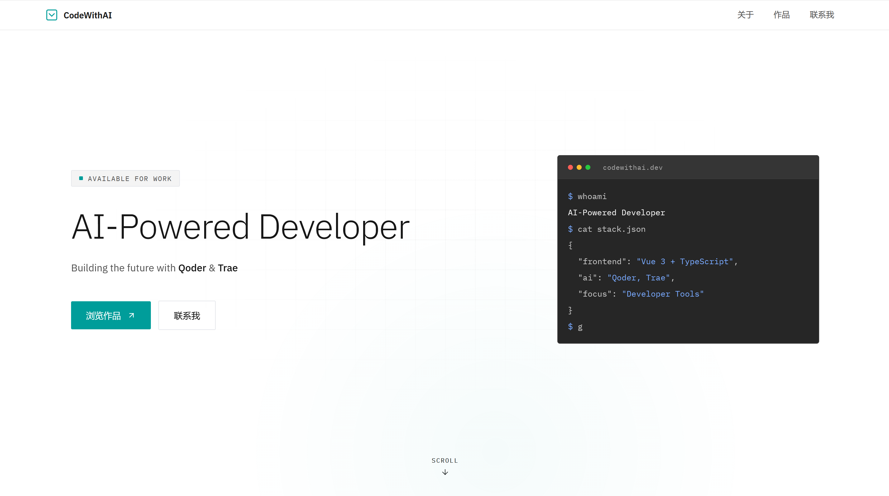

# 🎨 Homepage

> 当代码遇见设计，一个会呼吸的 AI 个人主页诞生了。

由 **QoderWork** 设计，**Trae** 开发实现的现代化个人主页，融合终端美学与流畅交互，打造独一无二的开发者名片。



---

## ✨ 功能特性

- 🚀 **响应式设计** - 完美适配桌面、平板、移动设备
- 🎭 **终端打字效果** - 模拟真实终端输入的炫酷动画
- ✨ **文字解码动画** - 赛博朋克风格的文字渐显效果
- 🌙 **深色主题** - 精心调校的暗色系视觉体验
- ⚡ **极速加载** - 基于 Nuxt 3 的静态站点生成
- 🔍 **SEO 优化** - 完整的元标签和结构化数据

---

## 🛠️ 技术栈

- **[Nuxt 3](https://nuxt.com/)** - 全栈 Vue 框架
- **[Vue 3](https://vuejs.org/)** - 渐进式 JavaScript 框架
- **[Tailwind CSS](https://tailwindcss.com/)** - 原子化 CSS 框架
- **[GitHub Pages](https://pages.github.com/)** - 静态站点托管

---

## 🚀 本地运行

### 环境要求

- Node.js 18+
- npm / pnpm / yarn

### 安装步骤

```bash
# 克隆项目
git clone https://github.com/budflower/homepage.git
cd homepage/nuxt3-app

# 安装依赖
npm install

# 启动开发服务器
npm run dev
```

打开浏览器访问 `http://localhost:3000`

### 构建部署

```bash
# 生成静态站点
npm run generate

# 预览构建结果
npx serve .output/public
```

---

## 📄 开源协议

[MIT License](./LICENSE) © 2026 budflower

---

<p align="center">Made with ❤️ by <a href="https://github.com/budflower">budflower</a></p>
